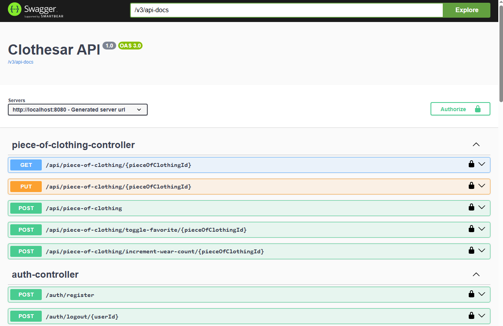

This service powers the wardrobe-management mobile app that allows users to upload,
categorize, and manage clothing items.
It provides a JSON/REST API secured with JWT.

## Features
- User authentication & authorization (JWT)
- CRU operations for clothing items
- OpenAPI/Swagger documentation for easy API exploration
- Stateless security (session-less)

## Tech Stack
- Java 21, Spring Boot 3.2
- Spring Security (JWT)
- Spring Web MVC
- Spring Data JPA
- OpenAPI/Swagger (Springdoc)
- PostgreSQL
- Docker & Docker Compose

## How to run it

Clone the repository:

```
git clone https://github.com/jakubdziem/wadrobe-api.git
cd wadrobe-api
```

Start the application with Docker:

```
docker compose up --build
```

Open the API documentation in your browser:

http://localhost:8080/swagger-ui.html

